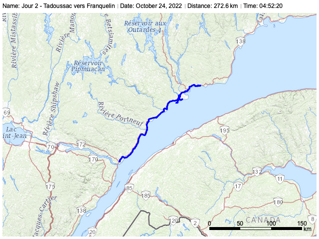
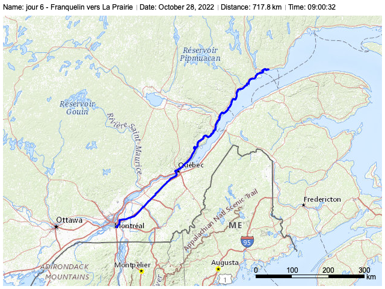

# La route 138

Mon exploration de la route 138 vers Kegaska ma fait parcourir 
2712.7km sur 6 jours.

## La Prairie à Tadoussac

2022-10-23

468.6km

## Tadoussac - Franquelin

2022-10-24

272.6km

{ width="480" }

## Franquelin - Pointe-à-Mingan

2022-10-25

391.6km

{ width="480" }

## Pointe-à-Mingan - Kegaska

2022-10-26

236.7km

{ width="480" }

## Kegaska - Pointe-à-Mingan

2022-10-26

236.6km

{ width="480" }

## Pointe-à-Mingan - Franquelin

2022-10-27

388.8km

{ width="480" }

## Franquelin - La Prairie

2022-10-28

717.8km

{ width="480" }
